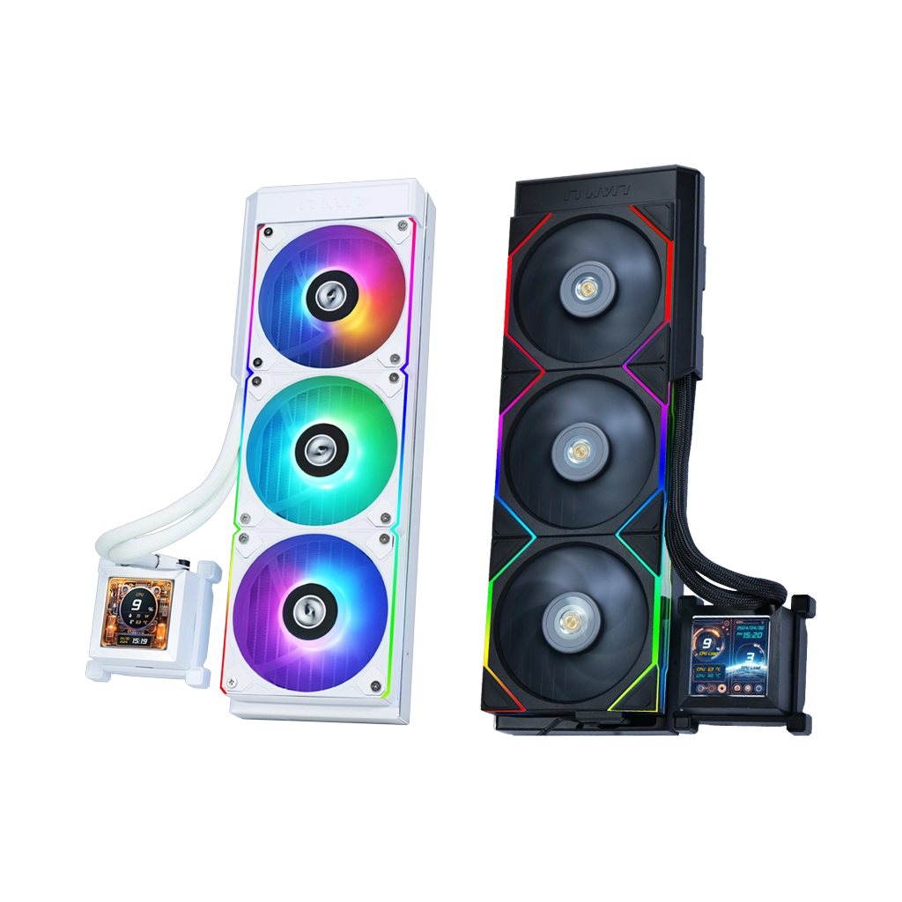
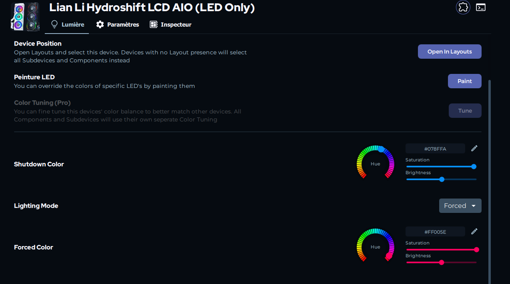
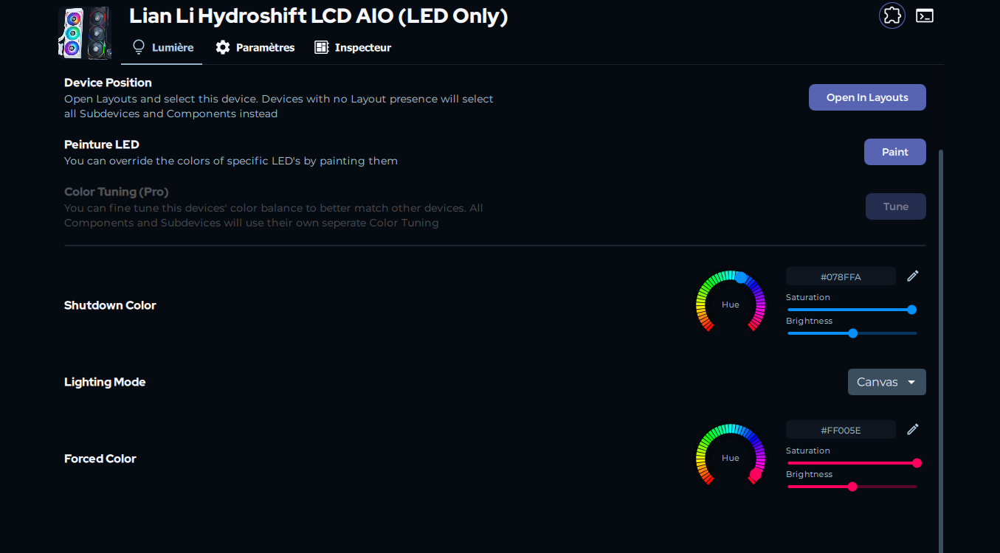
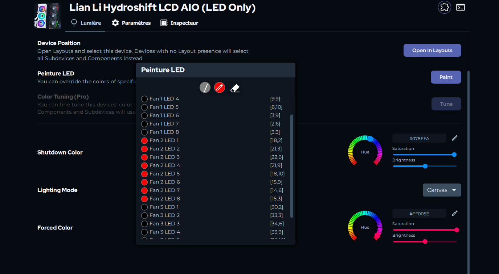

# 🌈 Lian Li HydroShift LCD RGB (LED Only) for SignalRGB

A custom SignalRGB **plugin** focused on HydroShift RGB LEDs only.

> [!NOTE]
> In SignalRGB terminology:
> - **Plugin** = device driver code (`.js`)
> - **Add-on** = distribution/update channel in SignalRGB UI that can deliver plugins

## ✨ Highlights
- ✅ Stable LED control for HydroShift in SignalRGB
- ✅ Supports `Forced`, `Canvas`, `Paint`, `Depaint`, `Shutdown Color`
- ✅ Coexists with **L-Connect** for LCD and cooling management
- ✅ Lightweight single-file plugin implementation

## 📸 Screenshots
| Forced | Canvas | Paint |
|---|---|---|
|  |  |  |

## 🔌 Compatibility
| Item | Value |
|---|---|
| Vendor ID | `0x0416` |
| Product ID | `0x7399` |
| HID Validation | `interface === 1` |
| LED Mapping | `3 fans x 8 LEDs = 24 LEDs` |

### HydroShift Variant Notes (Official Product Positioning)
| HydroShift Variant | Status in this repo | Official variant note |
|---|---|---|
| `360R` | ✅ Tested | Ships with ARGB fans (officially stated) |
| `360S` | ⚠️ Not validated yet | Ships with 3 preinstalled 28mm performance fans; unlike 360R it is not marketed as an ARGB-fan SKU (official page instead highlights compatibility with P28 side ARGB strips) |
| `360TL` | ⚠️ Not validated yet | TL modular fan variant with ARGB lighting features |
| `360N` | ⚠️ Not validated yet | Fanless SKU; fans must be purchased separately |

This project is **hardware/protocol-specific** to HydroShift behavior and is not a generic plugin for all Lian Li products.

## 🚀 Installation
### 1) Preferred: Add-on URL install
1. Open SignalRGB: `Settings` -> `Add-ons`
2. Click `Add Add-on` and paste: `https://github.com/Toufik1247/LianLi_HydroShift_LCD_RGB`
3. Enable/install the add-on
4. Restart SignalRGB if prompted
5. Verify device name: `Lian Li Hydroshift LCD AIO (LED Only)`

### 2) Manual fallback install
1. Place this folder in:
   - `%USERPROFILE%\Documents\WhirlwindFX\Plugins\Lian Li\LianLi_HydroShift_LCD_RGB`
2. Restart SignalRGB
3. Verify device name: `Lian Li Hydroshift LCD AIO (LED Only)`

If Add-on URL install is unavailable on your SignalRGB build, use manual install.

## 🧩 What This Plugin Does Not Control
- ❌ LCD screen content
- ❌ Pump behavior
- ❌ Fan speed / RPM control

Keep those functions in **L-Connect** (or future contributor extensions).

## ⚙️ Recommended L-Connect Coexistence
- Keep L-Connect active for LCD and pump/fan profiles
- Avoid simultaneous LED writes from L-Connect on this device
- Let SignalRGB own LED writes

Concurrent writes from both apps may cause flicker/conflicts.

## 🤝 Contributing
Contributions are welcome, especially for:
1. Compatibility validation across HydroShift variants and fan configurations
2. Protocol robustness across HydroShift revisions
3. Optional telemetry/control integration paths (where supported)
4. Diagnostics and developer tooling

### Compatibility Report Checklist
When reporting compatibility, include:
- Exact HydroShift model (for example `360R`, `360S`, `360TL`, `360N`)
- Color/SKU if known (black/white)
- Whether stock fans are used or replaced
- USB VID/PID seen in SignalRGB
- Whether `Forced`, `Canvas`, `Paint/Depaint`, and `Shutdown` work
- Any flicker/scintillation behavior
- SignalRGB version + L-Connect version

### Contributor Rules
- Keep only one active plugin `.js` file in the plugin folder
- Avoid aggressive re-init bursts inside render loops
- Validate changes in all modes: Forced, Canvas, Paint/Depaint, Shutdown

### Official SignalRGB Docs
- Plugin creation: https://docs.signalrgb.com/plugins/plugin-creation
- Plugin exports: https://docs.signalrgb.com/plugins/plugin-creation/plugin-exports
- Plugin runtime: https://docs.signalrgb.com/plugins/plugin-creation/plugin-runtime
- User controls: https://docs.signalrgb.com/plugins/plugin-creation/user-controls
- Writes/reads: https://docs.signalrgb.com/plugins/plugin-creation/writes-and-reads
- Fan control API: https://docs.signalrgb.com/plugins/plugin-creation/fan-control
- Plugin template: https://docs.signalrgb.com/plugins/plugin-creation/plugin-template
- Components: https://docs.signalrgb.com/plugins/plugin-creation/using-components

## 🗺️ Roadmap
1. Broader HydroShift hardware revision compatibility
2. Optional fan telemetry/control path (when feasible with supported APIs)
3. Extended runtime diagnostics toggles

## 📄 License
MIT — see [`LICENSE`](./LICENSE).
